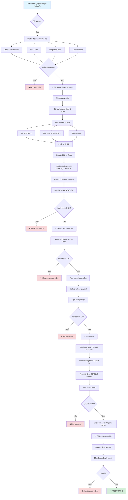

# Diagramas de Fluxo - Pipeline Enterprise

## 📊 Fluxo Completo: Commit → Production



## 🔄 Fluxo de Promoção Entre Ambientes

```
┌─────────────────────────────────────────────────────────────────────┐
│                       PROMOTION PIPELINE                             │
└─────────────────────────────────────────────────────────────────────┘

  DEVELOP                    QA                 STAGING              PRODUCTION
    │                        │                     │                      │
    │ v2026.02.1            │                     │                      │
    │ (auto-deployed)       │                     │                      │
    │                        │                     │                      │
    ├─[Health Check]─────►  │                     │                      │
    │  - Pods ready?        │                     │                      │
    │  - Error rate < 1%    │                     │                      │
    │  - Latency OK?        │                     │                      │
    │                        │                     │                      │
    │  ✅ PASS              │                     │                      │
    │                        │                     │                      │
    ├─[Smoke Tests]────────►│                     │                      │
    │  - /health returns 200│                     │                      │
    │  - /api/status OK     │                     │                      │
    │                        │                     │                      │
    │  ✅ PASS              │                     │                      │
    │                        │                     │                      │
    └──[Auto-Promote]──────►│ v2026.02.1         │                      │
                             │ (auto-deployed)    │                      │
                             │                     │                      │
                             ├─[E2E Tests]───────►│                      │
                             │  - User flows      │                      │
                             │  - API contracts   │                      │
                             │  - Performance     │                      │
                             │                     │                      │
                             │  ✅ PASS           │                      │
                             │                     │                      │
                             └──[Manual PR]──────►│ v2026.02.1          │
                                                   │ (manual approval)   │
                                                   │                      │
                                                   ├─[Load Test]────────►│
                                                   │  - 1000 RPS         │
                                                   │  - 30min soak       │
                                                   │  - Memory stable    │
                                                   │                      │
                                                   │  ✅ PASS            │
                                                   │                      │
                                                   └──[Manual PR]────────►│ v2026.02.1
                                                      (2+ SRE approvals)  │ (Blue/Green)
                                                                          │
                                                                          │ ✅ LIVE
```

## 🔀 Estratégia de Branches

```
┌─────────────────────────────────────────────────────────────────────┐
│                     TRUNK-BASED DEVELOPMENT                          │
└─────────────────────────────────────────────────────────────────────┘

                    ┌──────────────────────────────────────┐
                    │             main branch              │
                    │  (always deployable, protected)      │
                    └──────────────────────────────────────┘
                       │     │     │     │     │     │
                       │     │     │     │     │     │
        ┌──────────────┘     │     │     │     │     └──────────────┐
        │                    │     │     │     │                    │
        │                    │     │     │     │                    │
   feature/add-auth    feature/api   │   hotfix/db     feature/ui
   (short-lived)       (short-lived) │   (emergency)   (short-lived)
        │                    │     │     │     │                    │
        │                    │     │     │     │                    │
        │ PR + Review        │ PR  │ PR  │ PR  │ PR                 │
        └────────────────────┴─────┴─────┴─────┴────────────────────┘
                             │
                             │ (merge to main)
                             ▼
                    ┌──────────────────┐
                    │   CI Pipeline    │
                    │   (automated)    │
                    └──────────────────┘
                             │
                             ▼
                    ┌──────────────────┐
                    │  DEVELOP (auto)  │
                    └──────────────────┘
```

## 🎯 GitOps Repository Structure

```
nexo-gitops/
├── argocd/
│   ├── projects/
│   │   └── nexo-platform.yaml         ← AppProject (multi-tenant)
│   │
│   ├── applicationsets/
│   │   ├── nexo-apps.yaml             ← Gera 12 Applications
│   │   │                                 (3 serviços × 4 ambientes)
│   │   └── nexo-infrastructure.yaml   ← Infra compartilhada
│   │
│   ├── apps/                          ← Individual Applications (fallback)
│   │   ├── nexo-be-develop.yaml
│   │   ├── nexo-be-qa.yaml
│   │   ├── nexo-be-staging.yaml
│   │   └── nexo-be-production.yaml
│   │
│   └── root-app.yaml                  ← Bootstrap (App of Apps)
│
├── helm/
│   ├── nexo-be/
│   │   ├── Chart.yaml                 ← version: 0.1.0
│   │   ├── values.yaml                ← Defaults (shared)
│   │   │
│   │   ├── values-develop.yaml        ← image.tag: "2026.02.17"
│   │   ├── values-qa.yaml             ← image.tag: "2026.02.15"
│   │   ├── values-staging.yaml        ← image.tag: "2026.02.10"
│   │   ├── values-prod.yaml           ← image.tag: "2026.01.45"
│   │   │
│   │   └── templates/
│   │       ├── _helpers.tpl
│   │       ├── deployment.yaml
│   │       ├── service.yaml
│   │       ├── ingress.yaml
│   │       ├── hpa.yaml
│   │       ├── pdb.yaml
│   │       ├── servicemonitor.yaml
│   │       ├── externalsecret.yaml
│   │       └── networkpolicy.yaml
│   │
│   ├── nexo-fe/
│   │   └── ... (estrutura similar)
│   │
│   └── nexo-auth/
│       └── ... (estrutura similar)
│
└── README.md
```

## 🔒 Security Layers

```
┌─────────────────────────────────────────────────────────────────────┐
│                        DEFENSE IN DEPTH                              │
└─────────────────────────────────────────────────────────────────────┘

Layer 7: Application Security
├─ Structured logging (redact sensitive data)
├─ Input validation
├─ OWASP Top 10 protections
└─ Rate limiting

Layer 6: Secrets Management
├─ External Secrets Operator
├─ AWS Secrets Manager / Vault
├─ Automatic rotation (30 days)
└─ RBAC (least privilege)

Layer 5: Image Security
├─ Signed images (Cosign)
├─ SBOM generation (Syft)
├─ Vulnerability scanning (Trivy)
└─ Base image: distroless/alpine

Layer 4: Kubernetes Security
├─ NetworkPolicies (deny all + whitelist)
├─ PodSecurityStandards (restricted)
├─ RBAC (ServiceAccount per app)
└─ Admission Controller (Kyverno)

Layer 3: CI/CD Security
├─ OIDC (GitHub → Cloud)
├─ SAST (Semgrep)
├─ Dependency scanning (Snyk)
└─ Branch protection rules

Layer 2: Infrastructure Security
├─ Private subnets
├─ VPC isolation
├─ Security groups
└─ Encryption at rest/transit

Layer 1: Access Control
├─ SSO (Okta/Auth0)
├─ MFA required
├─ IP whitelisting
└─ Audit logging
```

## 📊 Observability Stack

```
┌─────────────────────────────────────────────────────────────────────┐
│                    OBSERVABILITY ARCHITECTURE                        │
└─────────────────────────────────────────────────────────────────────┘

                          ┌─────────────────┐
                          │   Application   │
                          │   (nexo-be)     │
                          └─────────────────┘
                                  │
            ┌─────────────────────┼─────────────────────┐
            │                     │                     │
            ▼                     ▼                     ▼
    ┌───────────────┐    ┌───────────────┐    ┌───────────────┐
    │   METRICS     │    │     LOGS      │    │    TRACES     │
    │  /metrics     │    │  stdout JSON  │    │ OpenTelemetry │
    └───────────────┘    └───────────────┘    └───────────────┘
            │                     │                     │
            │                     │                     │
            ▼                     ▼                     ▼
    ┌───────────────┐    ┌───────────────┐    ┌───────────────┐
    │  Prometheus   │    │   Promtail    │    │  OTEL Agent   │
    │  (scrape 30s) │    │  (tail logs)  │    │ (push traces) │
    └───────────────┘    └───────────────┘    └───────────────┘
            │                     │                     │
            │                     │                     │
            ▼                     ▼                     ▼
    ┌───────────────┐    ┌───────────────┐    ┌───────────────┐
    │  Prometheus   │    │     Loki      │    │    Jaeger     │
    │   Storage     │    │   Storage     │    │   Storage     │
    │  (30d retain) │    │  (90d retain) │    │  (7d retain)  │
    └───────────────┘    └───────────────┘    └───────────────┘
            │                     │                     │
            │                     │                     │
            └─────────────────────┴─────────────────────┘
                                  │
                                  ▼
                          ┌───────────────┐
                          │    Grafana    │
                          │  (dashboards) │
                          └───────────────┘
                                  │
                                  ▼
                          ┌───────────────┐
                          │   Engineers   │
                          │   (analysis)  │
                          └───────────────┘
```

## 🚨 Incident Response Flow

```
┌─────────────────────────────────────────────────────────────────────┐
│                       INCIDENT LIFECYCLE                             │
└─────────────────────────────────────────────────────────────────────┘

1. DETECTION (MTTD < 5min)
   ├─ Prometheus Alert fires
   ├─ PagerDuty notifies oncall
   └─ #incidents channel notified

2. TRIAGE (< 2min)
   ├─ Check dashboard (Grafana)
   ├─ Identify severity (P0-P4)
   └─ Assign incident commander

3. INVESTIGATION (< 10min)
   ├─ Check recent deployments
   │  └─ argocd app history nexo-be-production
   │
   ├─ Check logs
   │  └─ Loki: {service="nexo-be", level="error"}
   │
   ├─ Check traces
   │  └─ Jaeger: Find slow requests
   │
   └─ Check metrics
      └─ Prometheus: error_rate, latency

4. MITIGATION (MTTR < 30min)
   ├─ Option 1: Rollback
   │  └─ argocd app rollback nexo-be-production
   │
   ├─ Option 2: Scale down
   │  └─ kubectl scale deployment nexo-be --replicas=2
   │
   └─ Option 3: Hotfix
      └─ Emergency PR + fast-track deploy

5. COMMUNICATION
   ├─ Update #incidents channel
   ├─ Update status page
   └─ Notify stakeholders

6. RESOLUTION
   ├─ Verify metrics normalized
   ├─ Monitor for 15min
   └─ Declare resolved

7. POST-MORTEM (< 48h)
   ├─ Create GitHub issue
   ├─ Schedule blameless review
   ├─ Document learnings
   └─ Update runbooks

8. FOLLOW-UP
   ├─ Implement preventive measures
   ├─ Update monitoring/alerts
   └─ Track action items
```

---

**Dica**: Use estes diagramas como referência rápida. Para detalhes de implementação, consulte os documentos específicos.
